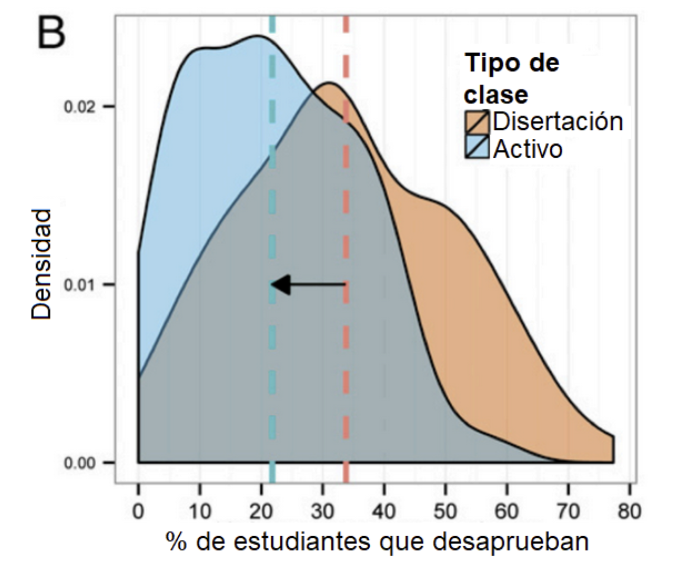
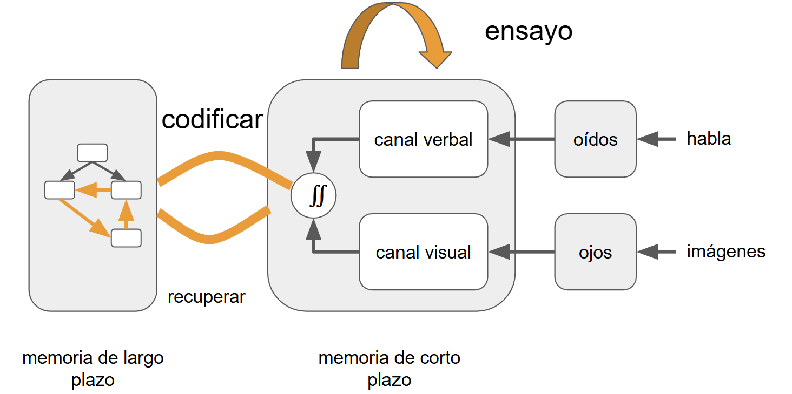
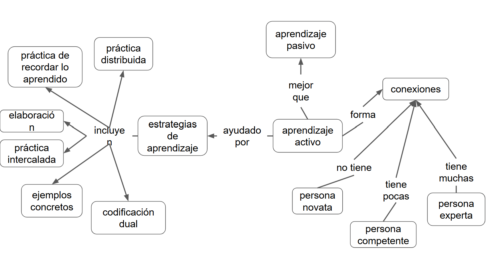

:::::::::::::::::::::::::::::::::::::: questions 

- ¿Cómo accedo al certificado de NASA Open Science 101?

- ¿Cómo accedo al certificado de MetaDocencia Herramientas de Ciencia Abierta?

::::::::::::::::::::::::::::::::::::::::::::::::

::::::::::::::::::::::::::::::::::::: objectives

- Identificar los requisitos mínimos para acceder a los certificados.

::::::::::::::::::::::::::::::::::::::::::::::::

## Aprendizaje

### Dos Formas de Aprender

|                         |                          |
|-------------------------|--------------------------|
| Leer algo               | Probar algo              |
| Ver un video            | Hacer ejercicios         |
| Ir a clase              | Discutir un tema         |
| Escuchar una explicación| Intentar explicar un tema|

Hemos estado hablando sobre cómo podemos construir mejores clases, sobre cómo motivar a tus estudiantes y de cómo asegurarnos de incluir a todas y todos. Ahora vamos a cambiar nuestro enfoque y hablaremos sobre cómo brindar esas lecciones y cómo fomentar que el aprendizaje sea más eficiente. 

Vimos al principio de este curso que el aprendizaje es tanto una actividad cognitiva como social. El aprendizaje ocurre cuando nuestro cerebro almacena hechos y procedimientos de manera que le permiten recordar y aplicar lo que necesita cuando lo necesita. También ocurre en un entorno social: se aprende por determinada razón, con otras personas, y tus objetivos, motivaciones y criterios para el éxito se determinan con esas y por esas personas. 

Otra de nuestras ideas clave es que tanto la enseñanza como el aprendizaje deben ser activos: una persona que recita una lección a sus estudiantes que simplemente escuchan es probablemente menos efectiva que una lección donde las personas que asisten participan.

Nuestro punto de partida es el contraste entre dos estilos de enseñanza. Vamos a tomarnos un momento y leer estas dos listas, luego voten en el chat por el estilo que creen que funciona mejor.

| Leer algo                | Probar algo                   |
|--------------------------|-------------------------------|
| Ver un video             | Hacer ejercicios              |
| Ir a clase               | Discutir un tema              |
| Escuchar una explicación | Intentar explicar un tema     |
| **Aprendizaje Pasivo**   | **Aprendizaje Activo**        |

Probablemente no sea sorprendente que los resultados del aprendizaje activo superen a los del aprendizaje pasivo.

### El Aprendizaje Activo Es Mejor

Por ejemplo, este gráfico muestra una reducción en las tasas de fracaso en las clases STEM (de [Active learning increases student performance in science, engineering, and mathematics](http://www.pnas.org/content/111/23/8410.full.pdf)) en un metaanálisis de 225 reportes sobre resultados de exámenes o tasas de desaprobación. En el eje X se presenta el porcentaje de estudiantes que desaprueban. La densidad promedio de estudiantes que desaprueban con aprendizaje por disertación es 33.8%. La densidad de estudiantes que desaprueban con clases de tipo activo es de 21.8%.

Tenemos ciencia cognitiva para explicar por qué el aprendizaje activo es mejor.

{alt="Gráfico que muestra que en clases con aprendizaje activo la mayoría de los cursos tienen ≈ 15-25 % de desaprobados, mientras que en clases expositivas la cifra sube a ≈ 30-50%. En promedio, el enfoque activo reduce la tasa de fracaso del 34 % al 23 %."}

Volvamos a nuestro modelo simplificado de arquitectura cognitiva para entender por qué. Teníamos dos tipos de memoria, una a corto plazo y otra a largo plazo.

{alt="Diagrama que representa el proceso de codificación de la información en la memoria de corto y largo plazo. A la derecha, los estímulos ingresan a través de los sentidos: los ojos reciben imágenes y los oídos reciben habla. Esta información llega al canal visual y al canal verbal, respectivamente, dentro de la memoria de corto plazo. Ambos canales se integran y pueden ser repetidos mediante ensayo. Desde allí, la información es codificada hacia la memoria de largo plazo, donde se organiza como esquemas. También puede recuperarse desde la memoria de largo plazo hacia la de corto plazo."}

Cuanto más tiempo permanezca algo en la memoria a corto plazo, mayores serán las posibilidades de que se codifique en la memoria a largo plazo. Hace que las personas ensayen información, por lo tanto, ayuda con la retención. 

Del mismo modo, cuanto más práctica tenga la gente para recuperar información, más enlaces se formarán en su modelo mental y más fuertes serán esos enlaces. Hacer que recuerden la información y la usen, por lo tanto, también aumenta el aprendizaje.

## PRIMM: un patrón de aprendizaje activo en programación

En la enseñanza de la programación, un error frecuente es pedir a las y los estudiantes que escriban código antes de poder leerlo y comprenderlo. Sin embargo, la investigación en educación en computación muestra de forma consistente que la comprensión de código precede al diseño y la escritura efectiva: las personas que recién empiezan necesitan primero desarrollar modelos mentales de cómo funciona un programa antes de poder crearlo por sí mismas. 

PRIMM es un patrón de enseñanza diseñado específicamente para abordar este problema. Su nombre proviene de las cinco fases que estructuran una secuencia de aprendizaje:

**Predecir** – **Ejecutar (Run)** – **Investigar** – **Modificar** – **Crear (Make)**

Este patrón propone una progresión cuidadosamente guiada desde la comprensión hacia la producción, y constituye un ejemplo claro de aprendizaje activo estructurado.

### Las cinco fases de PRIMM

**1. Predecir**

Las y los estudiantes observan un programa que ya existe y discuten qué creen que hará al ejecutarse. No escriben código ni lo ejecutan todavía: el foco está en activar conocimientos previos, formular hipótesis y explicitar modelos mentales. Esta etapa reduce la ilusión de comprensión y hace visibles ideas erróneas desde el inicio. 

**2. Ejecutar (Run)**

Luego, el programa se ejecuta y se compara el resultado real con las predicciones realizadas. El contraste inmediato entre expectativa y resultado genera retroalimentación rápida y promueve la revisión de los modelos mentales iniciales.

**3. Investigar**

En esta fase se analizan el código y su comportamiento con mayor profundidad. Se realizan actividades como trazar la ejecución paso a paso, explicar fragmentos en lenguaje natural, responder preguntas guiadas o identificar errores. El objetivo no es “que funcione”, sino entender por qué funciona. La investigación muestra que estas actividades de lectura y trazado son fundamentales para el aprendizaje de la programación.

**4. Modificar**

Una vez que el programa es comprendido, se realizan cambios controlados para alterar su comportamiento. Aquí comienza la transferencia de control: el código pasa de ser “de otra persona” a ser parcialmente propio. 

**5. Crear (Make)**

Finalmente, las y los estudiantes diseñan un programa nuevo que utiliza las mismas estructuras y conceptos, pero para resolver un problema diferente. Esta etapa apunta a la transferencia y generalización, y suele requerir más tiempo y apoyo, ya que implica integrar todo lo aprendido previamente.

### Por qué PRIMM funciona

PRIMM no es una técnica aislada, sino una síntesis de múltiples principios respaldados por la investigación:

- Prioriza la lectura y comprensión de código antes de la escritura, una relación fuertemente asociada al éxito en programación.

- Reduce la carga cognitiva, al trabajar con programas existentes y tareas acotadas en las primeras etapas.

- Favorece el aprendizaje activo, ya que cada fase requiere que las y los estudiantes piensen, discutan, expliquen y tomen decisiones.

- Integra el uso del lenguaje y la interacción social como herramientas centrales para construir comprensión, en línea con enfoques socioculturales del aprendizaje 

Estudios en contextos escolares muestran que estudiantes que aprenden programación con PRIMM obtienen mejores resultados que quienes siguen enfoques más tradicionales, y que el patrón resulta especialmente valioso en aulas con niveles heterogéneos de conocimiento previo 

Por eso, PRIMM funciona especialmente bien como ejemplo concreto de cómo los principios del aprendizaje activo pueden traducirse en actividades reales, particularmente en el contexto de la programación. No reemplaza a otras estrategias útiles de enseñanza, sino que las integra.  A continuación, revisamos seis estrategias respaldadas por la investigación que ayudan a aprender mejor y que pueden utilizarse tanto dentro de PRIMM como en muchas otras situaciones de enseñanza. Muchas de ellas se encuentran desarrolladas en más detalle en el sitio web [The Learning Scientists](http://www.learningscientists.org/). 

## Estrategias basadas en evidencia

### Práctica Distribuida

La primera estrategia es la práctica distribuida o práctica espaciada. Cinco sesiones de estudio de dos horas son más efectivas que dos sesiones de cinco horas, y mucho más efectivas que una sesión apretada de 10 horas. 

Si bien no podemos controlar los hábitos de estudio de nuestros estudiantes, podemos incluir material enseñado previamente en cada clase nueva. 

Del mismo modo y como estudiante, es bueno repasar una clase el mismo día de concluida, pero no inmediatamente después, e incorporar al repaso brevemente los conceptos principales de clases anteriores.

Espaciar las cosas puede ser una de las pocas ventajas de los formatos de clase tradicional sobre el aprendizaje en línea a demanda, porque el riesgo de clases asincrónicas es que nuestros estudiantes recién se expongan al material al final de la cursada.

### Recuperar lo Aprendido

El factor limitante de la memoria a largo plazo no es retener (qué la información se almacene) sino recordar (qué puede accederse). Nuestra segunda estrategia tiene que ver con la práctica de recuperación. 

Esto parece obvio: **serás mejor recordando cosas si practicas recordarlas.**

Pero es importante practicar recordar en un contexto realista. Si deseamos recuperar información para una evaluación de opción múltiple, practicaremos haciendo pruebas de opción múltiple; si deseamos recordar las reglas de sintaxis al programar, practicaremos recordarlas mientras programamos.

Una manera de ejercitar las habilidades para recordar es **resolver un mismo problema dos veces**. La primera vez, completamente de memoria. Tras evaluar nuestro propio trabajo con una rúbrica, resolver el problema de nuevo pero usando material de apoyo, para evaluar qué tan bien pudimos recordar y aplicar lo aprendido.

Otro método es **crear tarjetas de estudio (flashcards)**. Las tarjetas físicas tienen una pregunta en un lado y la respuesta en el otro, y existen muchas aplicaciones para generarlas disponibles para teléfono móvil. Si estamos estudiando en grupo, intercambiar las tarjetas de estudio con colegas nos ayudará a descubrir ideas importantes que tal vez habíamos obviado o malinterpretado.

Otro método muy útil es **leer-cubrir-recordar**. Mientras leemos algo, cubrimos términos clave o secciones con notas adhesivas pequeñas. Cuando hayas terminado, volvemos a leer y vemos qué tan bien podemos adivinar las palabras cubiertas.

### Elaboración

La tercera estrategia es la elaboración. 

Sabemos que enseñar algo es una excelente manera de aprenderlo y, en general, autoexplicarse un tema o explicarselo a otra persona es una buena manera de fortalecer nuestra comprensión del mismo. 

- Podemos explicar en voz alta un razonamiento. 

::::::::::::::::::::::::::::::::::::: instructor

Tal vez escucharon mencionar el **Rubber Duck Debugging (o “depuración con patito de hule”)**.

¿En qué consiste?

La idea es muy simple:

Tomamos un objeto inanimado (tradicionalmente, un patito de hule 🦆).

Le explicamos nuestro código en voz alta, línea por línea, asumiendo que el patito no sabe nada. Al intentar formular la explicación, nosotros mismos detectamos los errores, lagunas o suposiciones falsas.

Por supuesto, el patito no hace nada.

El efecto deseado ocurre porque explicar obliga a ordenar y hacer explícito el razonamiento, facilitando el detectar qué es lo que falla. 

::::::::::::::::::::::::::::::::::::::::::::::::

- Podemos hacer un seguimiento de cada pregunta en un cuestionario de práctica con una explicación detallada (propia) de por qué esa es la respuesta correcta y por qué otras no lo son. Esto obliga a distinguir conceptos parecidos, identificar límites y precisar definiciones. Evita aprender **de memoria**.

- También, comparar y contrastar información nueva con información vieja, buscar similitudes, detectar diferencias y decidir cuándo aplicar cada cosa. De esa forma, la información nueva no se almacena aislada, se integra con lo que ya sabíamos. Genera más enlaces en la memoria a largo plazo y, por lo tanto, facilita la transferencia a nuevas situaciones y la recuperación. 

::::::::::::::::::::::::::::::::: callout

Crear un mapa conceptual del contenido es una forma muy potente de elaboración. 

Cuando creamos un mapa conceptual, tenemos que:

1. Seleccionar qué conceptos son relevantes.
2. Organizarlos (qué va primero, qué depende de qué).
3. Explicitar relaciones ("Causa", "requiere", "produce", "se usa para..").
4. Comparar y jerarquizar ideas. 

Activa la **autoexplicación:**

Para decidir qué nodo va y cómo se conecta, la persona tiene que preguntarse:

- ¿Qué significa esto exactamente?

- ¿Por qué estos dos conceptos están relacionados?

Al construir enlaces, se toman deciciones como:

- ¿Esto es lo mismo o es distinto?

- ¿Este concepto es un caso particular o uno general?

- ¿Este enlace expresa causa, secuencia o condición?

Promueve la integración de los conceptos nuevos, con el conocimiento previo:

- Los conceptos nuevos se vinculan a nodos existentes. 

- Las relaciones previas se refuerzan o se revisan y corrigen.

- A veces aparecen contradicciones y nos obliga a resolverlas.

:::::::::::::::::::::::::::::::::

### Práctica Intercalada

La cuarta estrategia es intercalar los temas de estudio. En vez de dominar un tema, luego el segundo y el tercero, alternamos las sesiones de estudio entre un tema y otro. 

Mezclar el estudio de diferentes temas mejora el recuerdo posterior porque construye más enlaces de largo plazo en nuestro modelo mental. Aleatorizar el orden es mejor que seguir un patrón repetitivo. Pensemos en la letra de una canción: si siempre la practicamos en el mismo orden, solo podremos recuperarla en ese orden.

### Ejemplos Concretos

La quinta estrategia son los ejemplos concretos. 

Las personas novatas (e incluso las que son competentes) pueden no saber lo suficiente como para poder aplicar un principio general a un caso específico, entonces hay que proveer ejemplos. 

Del mismo modo, cada vez que resolvemos un problema específico, tomemos un momento para describir los principios generales utilizados en su resolución.

Intercalar ejemplos y definiciones ayuda a recordar mejor las definiciones.

### Codificación Dual

La estrategia final es la codificación dual, que discutimos anteriormente. Las imágenes y las palabras son más eficaces en combinación que por sí solas, porque apelan a sistemas de procesamiento cerebrales diferentes. 
Pero hay que tener cuidado al usar palabras e imágenes en simultáneo, porque el cerebro tiene que hacer un esfuerzo extra para interpretarlas.

::::::::::::::::::::::::::::::::::::: challenge 

Elijan una de las seis estrategias de aprendizaje y cuéntenle a su grupo cómo la usarían para aprender un tema particular.

- Práctica distribuida
- Práctica de recordar lo aprendido
- Elaboración
- Práctica intercalada
- Ejemplos concretos
- Codificación dual

Tiempo para el ejercicio: 10 minutos
Pueden resumirlo en el documento compartido.

::::::::::::::::::::::::::::::::::::::::::::::::

## Resumen

{alt="Mapa conceptual sobre estrategias de aprendizaje y niveles de experiencia. A la izquierda, se listan estrategias de aprendizaje: práctica distribuida, práctica de recordar lo aprendido, práctica intercalada, elaboración, ejemplos concretos y codificación dual, todas incluidas bajo el nodo estrategias de aprendizaje, que son ayudadas por el aprendizaje activo. A la derecha, se muestra que el aprendizaje activo es mejor que el 
aprendizaje pasivo y forma conexiones. Las conexiones son un indicador del nivel de experticia: una persona novata no tiene conexiones, una "persona competente" tiene pocas, y una persona experta tiene muchas"}

::::::::::::::::::::::::::::::::::::: keypoints 

- El aprendizaje es más efectivo cuando las personas participan activamente, usando, explicando y poniendo a prueba lo que aprenden, en lugar de solo recibir información.

- Las estrategias de aprendizaje activo ayudan a que la información se codifique mejor en la memoria a largo plazo y sea más fácil de recuperar y transferir.

- Patrones como PRIMM muestran cómo estructurar actividades que guían progresivamente desde la comprensión hacia la creación, reduciendo la carga cognitiva.

- Incorporar estrategias basadas en evidencia y promover la metacognición permite que estudiantes y docentes tomen decisiones más conscientes sobre cómo aprender mejor.

::::::::::::::::::::::::::::::::::::::::::::::::
